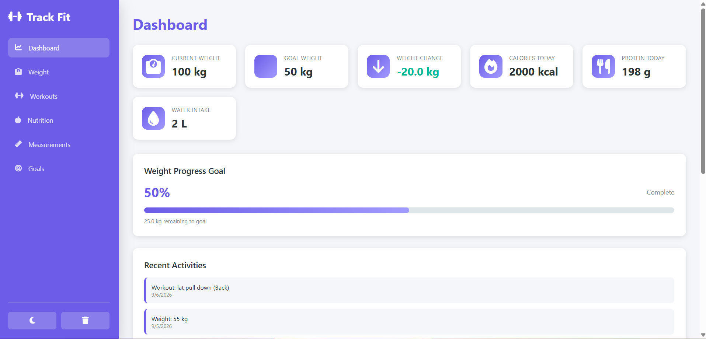
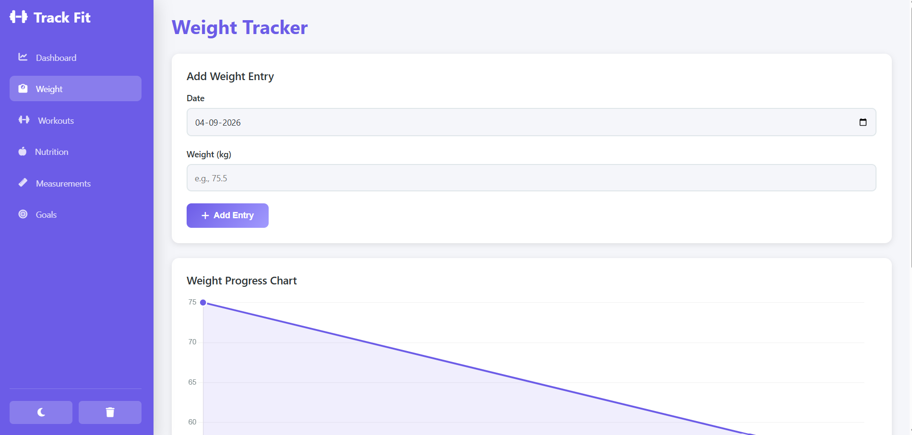
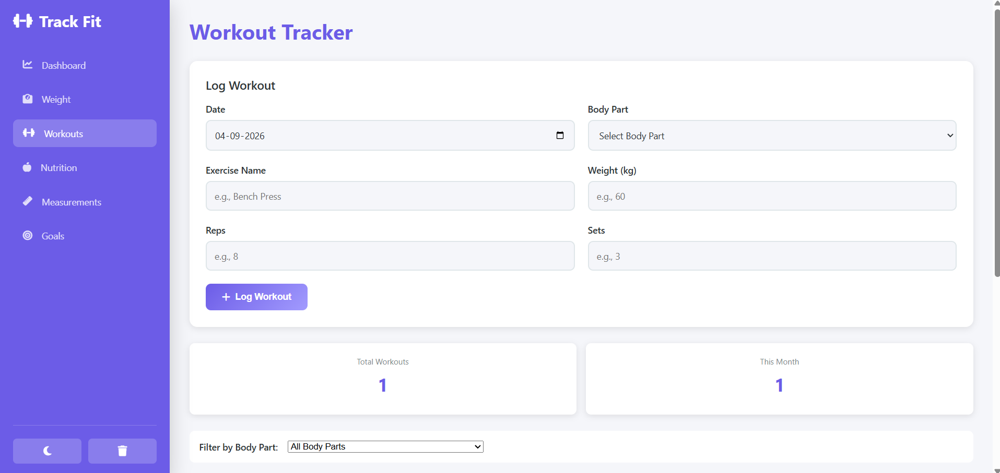
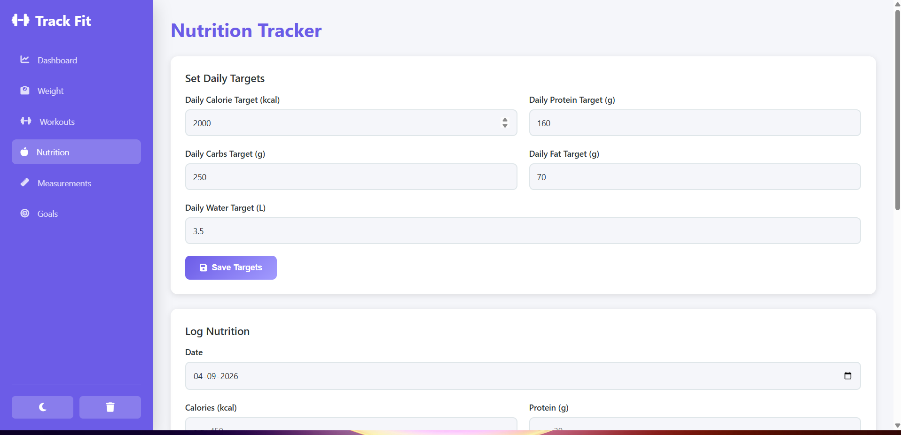
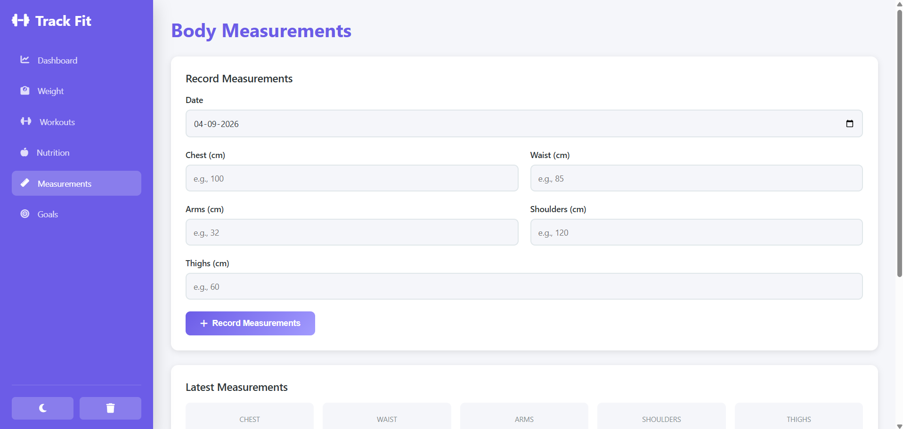
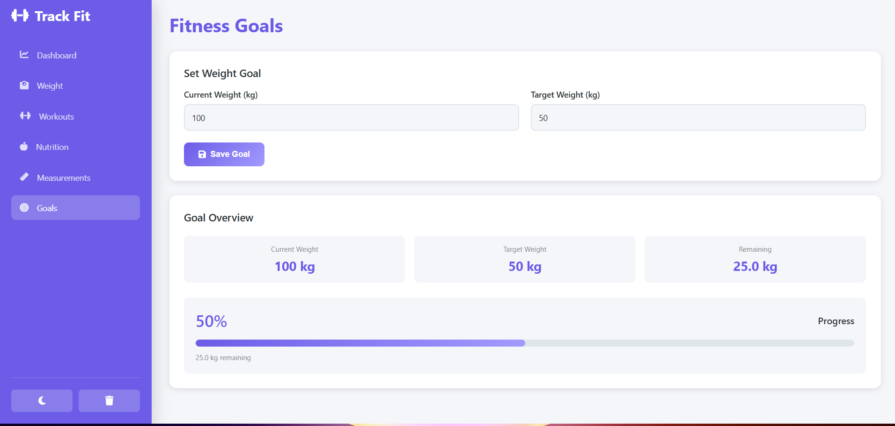

# FitTrack — Fitness Progress Tracker

A modern, responsive fitness dashboard for tracking weight, workouts, nutrition, measurements, and goals. Built with vanilla HTML5, CSS3, and JavaScript—no frameworks or backend required.

## 🎯 Features

### Dashboard
- **Quick Stats**: View current weight, goal weight, weight change, daily calories, protein, and water intake at a glance
- **Progress Visualization**: Visual progress bar toward your weight goal
- **Recent Activities**: Track your recent weight, workout, and nutrition entries
- **Weight Trend Chart**: Interactive line chart showing your weight progression over time

### Weight Tracker
- **Add Weight Entries**: Log your weight with dates
- **Weight History**: View all recorded weights in an organized table
- **Weight Change Calculation**: See how much you've lost or gained
- **Progress Chart**: Beautiful Chart.js line graph tracking your weight over time
- **Edit/Delete Entries**: Modify or remove weight records

### Workout Tracker
- **Log Workouts**: Record exercises with body part, exercise name, weight, reps, and sets
- **Workout History**: View all logged workouts, sorted by date
- **Filter by Body Part**: Easily find workouts for specific muscle groups
- **Personal Records**: Automatically calculate and display your best lift for each exercise
- **Workout Statistics**: Track total workouts and monthly workout count

### Nutrition Tracker
- **Set Daily Targets**: Configure your daily goals for calories, protein, carbs, fat, and water
- **Log Nutrition**: Record meals with macronutrient and water intake information
- **Daily Progress Bars**: Visual representation of your daily nutrition goals
- **Nutrition History**: Complete log of all nutrition entries

### Body Measurements
- **Record Measurements**: Track chest, waist, arms, shoulders, and thighs
- **Latest Measurements Display**: Quick view of your most recent measurements
- **Measurement History**: Table of all recorded measurements over time

### Goals
- **Weight Goal Setting**: Set current and target weights
- **Automatic Progress Calculation**: System calculates remaining weight and progress percentage
- **Visual Progress Bar**: See your progress toward your goal

### Additional Features
- **Dark/Light Mode**: Toggle between themes with persistent preference saving
- **Responsive Design**: Works perfectly on desktop, tablet, and mobile devices
- **Data Persistence**: All data saved to browser's LocalStorage—no account needed
- **Form Validation**: User-friendly validation with clear error messages
- **Confirmation Dialogs**: Safety confirmations before deleting data
- **Demo Data**: Sample data on first launch (easily clearable)
- **Clear All Data**: Option to reset all tracked information

## 🛠️ Tech Stack

- **Frontend**: HTML5, CSS3, Vanilla JavaScript
- **Storage**: Browser LocalStorage (no backend required)
- **Charts**: Chart.js v3.9.1 (via CDN)
- **Icons**: Font Awesome 6.4.0 (via CDN)
- **Deployment**: Static files—can run anywhere


## 🚀 How to Run

### Option 1: Direct Browser (Simplest)
1. Extract all files to a folder
2. Open `index.html` in your web browser
3. Start tracking!

### Option 2: VS Code with Live Server
1. Open the project folder in VS Code
2. Install the "Live Server" extension (by Ritwick Dey)
3. Right-click on `index.html` and select "Open with Live Server"
4. The project will open in your browser automatically

### Option 3: Python Server (if installed)
```bash
# Python 3.x
python -m http.server 8000

# Python 2.x
python -m SimpleHTTPServer 8000
```
Then open `http://localhost:8000` in your browser.

## 💾 LocalStorage Usage

The application stores all data in the browser's LocalStorage. Keys used:

- `weights` — Array of weight entries
- `workouts` — Array of workout entries
- `nutritionHistory` — Array of nutrition entries
- `measurements` — Array of measurement entries
- `goals` — Current weight goal object
- `nutritionTargets` — Daily nutrition targets
- `todayNutrition` — Today's nutrition summary
- `theme` — Dark/light mode preference
- `hasInitialized` — Demo data initialization flag

## 🎨 Design Highlights

- **Modern UI**: Clean dashboard with cards, progress bars, and icons
- **Color Scheme**: Professional purple primary color (#6c5ce7) with complementary secondaries
- **Responsive**: Tested and works on:
  - Desktop (1920px+)
  - Laptop (1366px+)
  - Tablet (768px-1024px)
  - Mobile (360px-767px)
- **Accessibility**: Proper contrast, semantic HTML, and readable typography
- **Performance**: No external dependencies beyond CDN libraries, fast load time

## 📊 Data Validation

The application includes comprehensive validation:
- ✅ Weight cannot be negative or zero
- ✅ Sets, reps, and exercise weight must be positive
- ✅ Nutrition values must be positive
- ✅ All required fields must be filled
- ✅ Date validation using HTML5 date inputs
- ✅ Confirmation dialogs before destructive operations

## 🔄 Workflow Example

1. **First Launch**
   - App loads with demo data
   - Dashboard shows sample weight, workouts, and nutrition

2. **Set Your Goals**
   - Go to Goals section
   - Enter current weight and target weight
   - System calculates progress automatically

3. **Start Tracking**
   - Log daily weight in Weight section
   - Add workouts in Workout section
   - Track nutrition in Nutrition section
   - Record measurements in Measurements section

4. **Monitor Progress**
   - Dashboard updates automatically
   - View weight chart and trend
   - Check personal records for exercises
   - See nutrition progress against daily targets

5. **Optional: Clear Data**
   - Use theme/clear button in sidebar
   - Confirms before deletion
   - Theme preference is preserved

## 🎓 Learning Outcomes

Building this project teaches:
- ✅ Vanilla JavaScript (no frameworks)
- ✅ LocalStorage API for data persistence
- ✅ HTML5 semantic structure
- ✅ CSS3 responsive design with media queries
- ✅ Chart.js integration and configuration
- ✅ Form validation and user feedback
- ✅ Event handling and DOM manipulation
- ✅ Code organization and modular JavaScript
- ✅ UX best practices (confirmations, loading states, etc.)

## 🚀 Future Improvements

Potential features for version 2:
- Export data to CSV/PDF
- Import data from external sources
- Multiple user profiles
- Photo progress tracking
- Workout video tutorials integration
- Social sharing features
- Push notifications for goals
- Mobile app version (React Native/Flutter)
- Backend integration (Firebase, Supabase)
- More detailed analytics and insights

## 📸 Screenshots

*Dashboard*:
*Weight Tracker*: 
*Workout Tracker*: 
*Nutrition Tracker*:
*Measurements*: 
*Goals*: 
## 👨‍💻 Author

Sadanandf wadle 
A computer science student at jspm Pune .

### Portfolio Value

This project showcases:
- Full-featured single-page application
- Professional UI/UX design
- Complete data persistence
- Responsive mobile design
- Clean, well-organized code
- Production-ready features
- No external frameworks (pure vanilla JavaScript)

## 📄 License

This project is open source and available for educational and personal use.

## 🤝 Contributing

This is a learning project, but feel free to fork and customize it for your own fitness tracking needs!

---

**Happy Tracking! 💪**